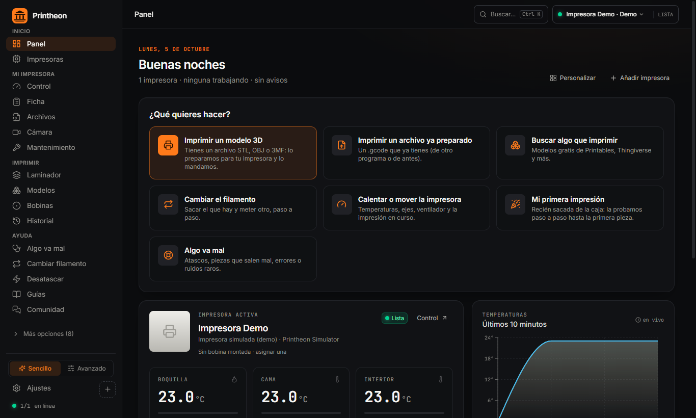

  

<h1 align="center">Printheon</h1>

<h3 align="center">La única app que necesita tu impresora 3D.</h3>

  Control · Laminado · Calibración · Diagnóstico · Reparaciones · Vigilancia · Filamento · Firmware · Granja de impresoras

  
  
  
  
  
  

  <a href="README.md"><b>🇬🇧 Read in English</b></a> ·
  <a href="#lo-que-sustituye">Lo que sustituye</a> ·
  <a href="#funciones">Funciones</a> ·
  <a href="#todas-las-impresoras">Todas las impresoras</a> ·
  <a href="#estado">Estado</a>

  

## Se acabó ir saltando de programa en programa

Un laminador. El panel web de la impresora. Una app del móvil para la cámara. Un detector de espagueti en la nube. Una hoja de cálculo para las bobinas. Una calculadora de costes. Y foros, vídeos y suerte cada vez que la impresora da un error.

**Printheon sustituye todo eso por una sola app de escritorio.** Conectas la impresora una vez y lo haces todo desde la misma ventana: buscas un modelo, lo laminas, lo mandas, lo vigilas y arreglas la impresora cuando algo falla. Lee tu máquina sola, conoce sus límites oficiales y no deja que nada se los salte.

Dos modos, una app. **Sencillo** para quien solo quiere imprimir. **Avanzado** para quien quiere todos los parámetros, todas las calibraciones y una granja de impresoras entera.

## Lo que sustituye

| Lo que usas hoy | En Printheon |
|---|---|
| Cura / PrusaSlicer / OrcaSlicer | **Laminador integrado** con el motor de OrcaSlicer y perfiles de tu impresora exacta |
| Mainsail, Fluidd, OctoPrint, Bambu Studio, PrusaLink | **Un solo panel de control** para todas tus impresoras, tengan el firmware que tengan |
| Servicios de detección de fallos en la nube | **Detección de espagueti con IA que funciona en tu PC**, sin nube ni suscripción |
| Hojas de cálculo de bobinas | **Inventario de filamento** que descuenta cada impresión solo |
| Foros y YouTube cuando algo se rompe | **Pruebas automáticas de la impresora, buscador de códigos de error, 25 soluciones guiadas y 46 guías de reparación** |
| Piezas de calibración y copiar números a mano | **Calibraciones que se lanzan, se aplican y se guardan solas** |
| Calculadoras de costes en internet | **Coste real por pieza y presupuestos** con margen, IVA y seguimiento de encargos |
| Printables / Thingiverse en otra pestaña | **Buscador de modelos dentro de la app**, a un clic de laminar |

## Funciones

### 🎛️ Control total, con cualquier impresora
Temperaturas, ejes, ventiladores, luces, parada de emergencia, y velocidad y flujo en directo a mitad de impresión. Cámara en directo, fotos y timelapses automáticos. Archivos y colas de impresión, y además **modo granja**: un panel con todas tus impresoras y una cola que manda cada trabajo a la siguiente que quede libre.

### 📋 Lee tu impresora por ti
Al conectarla, Printheon lee todo lo que la impresora sabe de sí misma: volumen de impresión, boquilla, temperaturas máximas, versiones de firmware, offsets del sensor, malla de la cama, Z offset… Lo compara con la ficha oficial del fabricante y te avisa si algo no cuadra. No escribes ni un solo dato.

### 🩺 Cuando algo falla, averigua por qué
Esto es lo que hace distinta a Printheon. Cuando una impresora da un error, lo normal es acabar desenchufando cables y encendiendo ventiladores uno por uno para ir descartando. **Printheon lo hace por ti:**

- **13 pruebas automáticas:** conexión, termistores, cada ventilador por separado, calentador de la boquilla, calentador de la cama, finales de carrera, sensor de nivelación, homing, movimiento, extrusor, sensor de filamento, luces y cámara. Cada prueba enciende, mide, te pregunta qué has visto y al terminar lo apaga todo. Los resultados se guardan para compararlos con el tiempo.
- **Buscador de códigos de error:** códigos HMS de Bambu Lab, números de error de Prusa y mensajes de Klipper y Marlin. Te explica el error y lanza las pruebas relacionadas.
- **25 soluciones guiadas** para problemas reales: la primera capa no pega, esquinas levantadas, hilos, falta de extrusión, capas desplazadas, espagueti, errores de temperatura, desconexiones y más.

### 🔧 Desatasca sola o paso a paso
Le dices el síntoma y elige el método que funciona: purgado en caliente, extrusión por pulsos, cold pull, atasco en el disipador o engranajes del extrusor. Automático cuando la impresora puede hacerlo sola, guiado cuando hay que meter mano. Las temperaturas siempre son las del material cargado. El cambio de filamento también es guiado, para cambiar de color sin atascos.

### 🎯 Calibraciones que terminan el trabajo
- **PID automático** de boquilla y cama: se lanza, se aplica y se guarda, sin copiar números.
- **Compensación de vibraciones (input shaper)** con el acelerómetro de la impresora: mide cada eje y elige el mejor filtro.
- **Z offset con un folio**, y **babystep que se guarda para siempre**.
- **Malla de la cama**: medirla, verla y guardarla.
- Guías de pasos del extrusor, pressure advance y tensión de correas.

### 👁️ Vigila cada impresión
- **Detección de espagueti con IA en la cámara**, funcionando en tu propio ordenador. Puede pausar la impresión antes de que se pierda una bobina entera.
- **Vigilancia de la telemetría**: temperatura que se pierde a mitad de impresión, calentadores que no llegan, un termistor suelto, una impresión que no avanza, una conexión que se cae o una cámara tapada.
- **Avisos al móvil** por Telegram, Discord o ntfy.

### 🛡️ Firmware y copias de seguridad
- Ficha de firmware de cada modelo: la versión oficial, cómo actualizarla, los firmwares de la comunidad con sus riesgos reales y los problemas conocidos.
- Avisos de actualización para Klipper, Bambu Lab y OctoPrint.
- **Copias automáticas de la configuración** (printer.cfg y macros, config de RRF, EEPROM de Marlin), listas para restaurar si una actualización sale mal.

### 🖨️ Y todo lo que rodea a la impresión
- **Laminador** con el motor de OrcaSlicer y perfiles oficiales, comparador A/B de perfiles y el coste de cada pieza.
- **Modelos 3D**: Printables y Thingiverse por categorías dentro de la app, tu propia biblioteca y laminar con un clic. Enlaces a MakerWorld, Thangs, Cults3D, MyMiniFactory y más.
- **Bobinas**: inventario por material, color y peso. Cada impresión se descuenta sola y te avisa antes de que se acabe.
- **Historial y estadísticas** de todas tus impresiones.
- **Mantenimiento** con avisos según las horas de uso: engrase, correas, boquilla.
- **Presupuestos y encargos** con coste real, margen e IVA, para quien vende impresiones.
- **Asistente de primera impresión**: de la caja a la primera pieza buena, comprobando todo por el camino.
- Buscador de todo con **Ctrl + K**, exportación de perfiles y copia de seguridad de toda la app.

## Hecha para no estropear tu impresora

Cada temperatura, velocidad, flujo y comando que envía Printheon se comprueba contra los **límites oficiales de tu impresora**. Si se pasa, se bloquea. Da igual que venga de un botón, de una macro, del terminal o de un archivo G-code. Las calibraciones y pruebas siempre dejan todo como estaba: lo que encienden, lo apagan.

## Todas las impresoras

Si tu impresora usa **Klipper, Marlin, RepRapFirmware, PrusaLink, OctoPrint, ESP3D, Bambu Lab o el firmware de red de Elegoo**, Printheon puede manejarla. Eso es prácticamente cualquier impresora FDM del mercado.

| Conexión | Qué cubre |
|---|---|
| **Klipper** (Moonraker, Mainsail, Fluidd, RatOS) | Voron, RatRig, Sovol SV08, Elegoo Neptune 4, Qidi, Creality con Klipper y cualquier montaje con Klipper |
| **Bambu Lab** en red local | A1 mini, A1, P1P, P1S, X1 Carbon, X1E, H2D y el resto de la gama |
| **PrusaLink** | MK4 / MK4S, MK3.5, MINI+, XL, CORE One |
| **Cable USB** (Marlin) | Ender, CR-10, Anycubic, Artillery, Prusa MK3S+, Sovol, Geeetech y cualquier impresora con Marlin |
| **OctoPrint** | Cualquier impresora con OctoPrint |
| **Duet / RepRapFirmware** | Duet 2, Duet Maestro, Duet 3 |
| **ESP3D** | Placas WiFi de BigTreeTech, MKS y otras |
| **Elegoo** en red local | Centauri Carbon 2 |

Además, el catálogo integrado trae la **ficha oficial de 254 modelos y 102 variantes de 58 marcas**, todas con su fuente: volumen, temperaturas, velocidades, firmware y perfil de laminado.

<b>Ver los 254 modelos por marca</b>

| Marca | Modelos |
|---|---|
| **Creality** | K1 · K1 SE · K1C · K1 Max · K2 SE · K2 · K2 Pro · K2 Plus · K3 (KliTek) · Hi · Ender 3 · Ender 3 V2 · Ender 3 S1 · Ender 3 S1 Plus · Ender 3 V3 SE · Ender 3 V3 KE · Ender 3 V3 · Ender 3 V3 Plus · Ender 5 · Ender 5 Plus · Ender 5 S1 · Ender 5 Max · Ender 6 · CR-6 SE · CR-6 Max · CR-10 V2 · CR-10 V3 · CR-10 Max · CR-10 SE · CR-M4 · Sermoon V1 · SPARKX i7 · Ender-3 V4 |
| **Anycubic** | Kobra 2 series · Kobra S1 · Kobra 3 · Kobra 3 Max · Kobra S1 Max · Vyper · Mega X · Kobra · Kobra Plus · Kobra Max · Kobra Neo · Kobra X · i3 Mega S · Chiron · 4Max Pro / 4Max Pro 2.0 · Predator (delta) |
| **Bambu Lab** | A1 mini · A1 · A2L · P1P · P1S · P2S · X1 Carbon · X1E · X2D · H2S · H2D · H2C · H2D Pro |
| **Geeetech** | A10M / A10T · A20 / A20M · A30 Pro / A30M / A30T · A10 Pro · Mizar M · Mizar S · Mizar Pro · Mizar · Mizar Max · Thunder · M1 (mini) |
| **Artillery** | Sidewinder X2 · Sidewinder X4 Pro · Genius Pro · Sidewinder X3 Plus · Sidewinder X3 Pro · Sidewinder X4 Plus · Sidewinder X1 · Genius · Hornet · M1 Pro |
| **Elegoo** | Neptune 3 / 3 Pro · Neptune 4 series · Centauri Carbon · Centauri Carbon 2 · OrangeStorm Giga · Neptune 2 / 2S · Neptune 2D · Neptune X · Centauri · Centauri 2 |
| **QIDI Tech** | X-Plus 3 · X-Max 3 · Plus4 · Max4 (X-Max 4) · Q1 Pro · Q2 / Q2C · X-Smart 3 · X-Max · X-Plus · X-CF Pro |
| **FlashForge** | Adventurer 5M · AD5X · Creator 4 · Creator 5 / 5 Pro · Guider 3 Ultra · Guider 4 / 4 Pro · Guider 2s · Adventurer 3 · Adventurer 4 |
| **Sovol** | SV06 / SV06 Plus · SV07 / SV07 Plus · SV08 (CoreXY) · SV08 Max · Zero · SV06 ACE / SV06 Plus ACE · SV01 / SV01 Pro · SV02 · SV05 |
| **Volumic** | EXO42 · EXO65 · SH65 · VS30SC2 · VS30MK3 · VS30SC · VS30MK2 · VS30 Ultra · VS20MK2 |
| **Prusa Research** | i3 MK3S+ · MK4 / MK4S · MK3.5 / MK3.5S · Core One · Core One L · XL · MINI+ |
| **FLSun** | S1 · T1 · V400 · QQ-S Pro · Q5 |
| **MagicMaker** | BoneKing · hj SK · hqs SF · hqs hj · slb |
| **Snapmaker** | J1 / J1s · U1 · Artisan (3-en-1) · A350 / A350T · A250 / A250T |
| **Voron** | V2.4 R2 · V0.2 · Trident · Switchwire · V0.1 |
| **Z-Bolt** | S300 · S400 · S600 · S1000 · S800 Dual |
| **CoLiDo** | SR1 · DIY 4.0 · X16 · 160 V2 |
| **FlyingBear** | Ghost 7 · Ghost 6 · Reborn 3 · S1 |
| **RatRig** | V-Core 4 · V-Core 3 · V-Minion · V-Cast |
| **re:3D** | Gigabot 4 · Terabot 4 · GigabotX 2 (granza) · TerabotX 2 (granza) |
| **SeeMeCNC** | RostockMAX v4 · RostockMAX v3.2 · BOSSdelta 300 · BOSSdelta 500 |
| **Tiertime** | UP300 HS · UP600 HS · UP400 Pro · UP310 Pro |
| **Ultimaker** | S5 / S5 Pro Bundle · S3 / S3 Pro · Method X · Ultimaker 2 |
| **Wanhao** | Duplicator 12/300 · Duplicator 12/230 M2 PRO · Duplicator 12/300 M2 PRO MAX · Duplicator 12/500 PRO MAX M2 |
| **BIQU** | Hurakan · BX · B1 |
| **BLOCKS** | Pro S100 · RD50 V2 · RF50 |
| **Cubicon** | xCeler Plus · xCeler-I · xCeler Mini |
| **DeltaMaker** | DeltaMaker 2 · DeltaMaker 2T · DeltaMaker 2XT |
| **Dremel** | DigiLab 3D45 · DigiLab 3D40 · Idea Builder 3D20 |
| **Folger Tech** | FT-5 · FT-6 · i3 (kit) |
| **Kingroon** | KP3S / KP3S Pro · KP5L · KLP1 |
| **LulzBot** | TAZ Pro / TAZ Pro Dual · TAZ 6 · TAZ 4 / TAZ 5 |
| **Two Trees** | SK1 · Sapphire Plus · SP-5 |
| **Comgrow** | T300 · T500 |
| **Construct3D** | Construct 1 · Construct 1 XL |
| **Eryone** | Thinker X400 · ER-20 |
| **InfiMech** | EX · TX |
| **RolohaunDesign** | Rook MK1 (LDO) · Delta Flyer Refit |
| **SecKit** | SK-Tank · Go3 |
| **WEMAKE3D** | Phoenix Pro · TinyBot |
| **WonderMaker** | ZR Ultra · ZR |
| **Afinia** | H+1 (HS) |
| **AnkerMake** | M5 / M5C |
| **Chuanying** | X1 |
| **Co Print** | ChromaSet |
| **LH** | Stinger |
| **LONGER** | LK10 / LK10 Plus |
| **Mellow** | M1 |
| **OpenEYE** | Peacock V2 |
| **Peopoly** | Magneto X |
| **Phrozen** | Arco |
| **Positron3D** | The Positron |
| **Raise3D** | Pro3 series |
| **RH3D** | E3NG v1.2S |
| **Tronxy** | X5SA-400 |
| **Vivedino** | Troodon 2.0 |
| **Voxelab** | Aquila X2 |
| **VzBoT** | VzBoT AWD |

## Estado

Printheon está en pleno desarrollo y **todavía no está publicada**. La enseño ya para saber qué necesita más la gente antes de la primera versión pública.

| | |
|---|---|
| **Plataforma** | App de escritorio para Windows |
| **Idioma** | Español; el inglés viene después |
| **Precio** | Gratis. Sin funciones de pago ni suscripciones |
| **Apoyo** | Habrá un Patreon para quien quiera echar una mano. Agradecimientos y betas antes que nadie, nunca funciones bloqueadas |

## Tu opinión cuenta

Abre un [issue](../../issues) para:
- pedir una función,
- pedir tu impresora si no está en la lista,
- contarme qué programas usas hoy, para que Printheon también los sustituya.

⭐ **Dale una estrella al repositorio** para seguir el desarrollo y enterarte del lanzamiento.

---

Capturas sacadas de la versión en desarrollo con el simulador de impresora integrado. © Printheon. Todos los derechos reservados.
