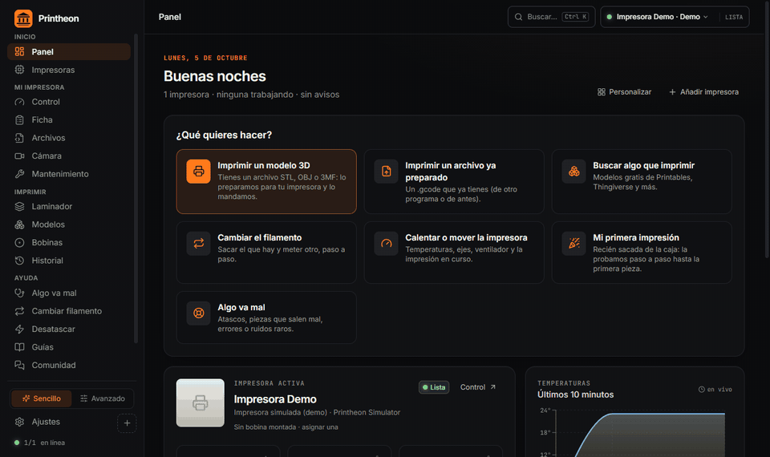
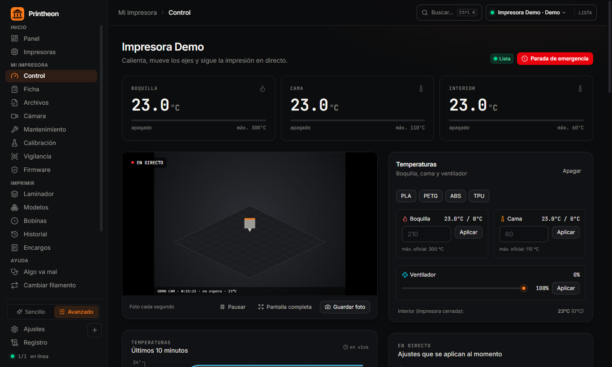
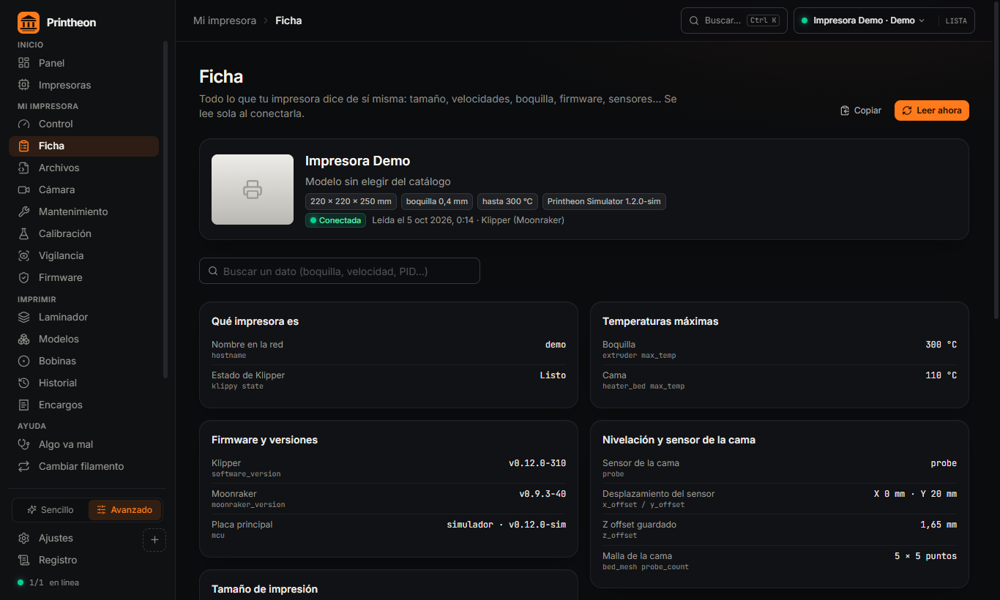
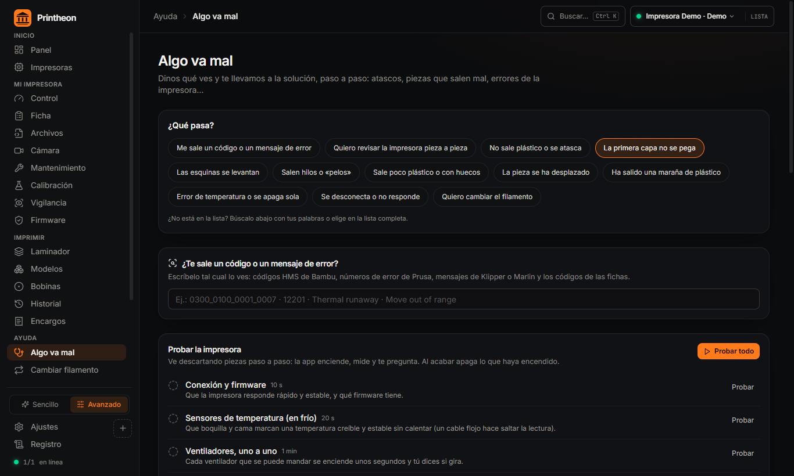
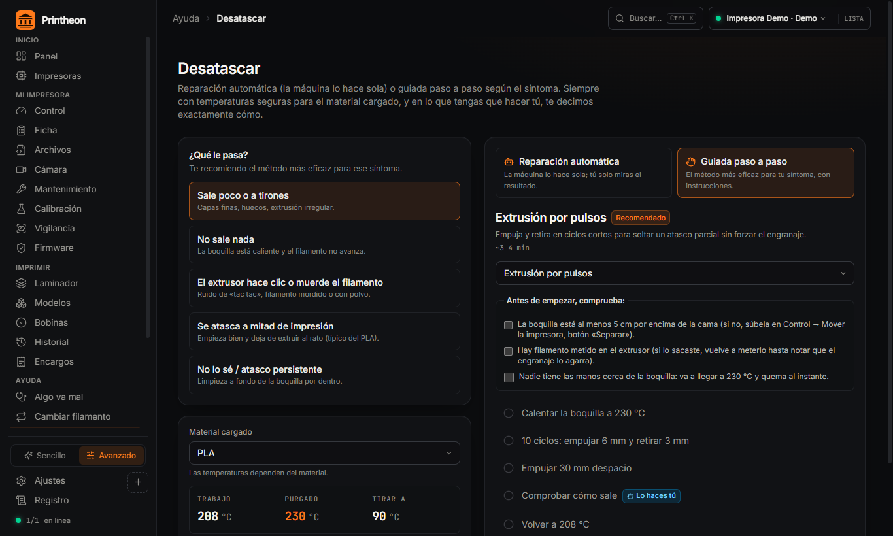
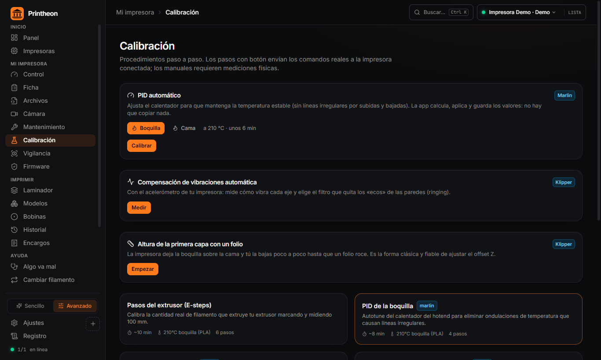
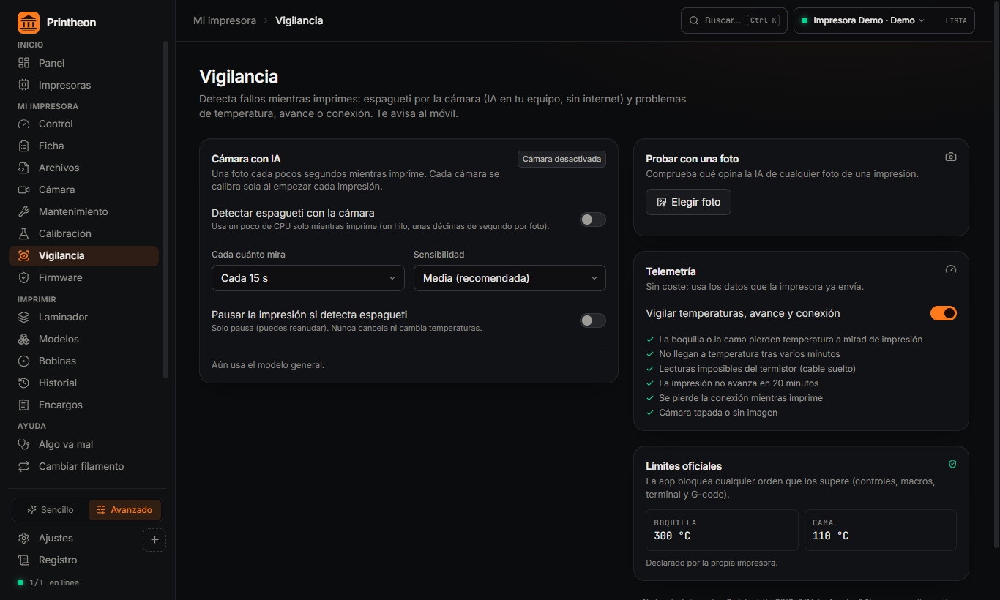
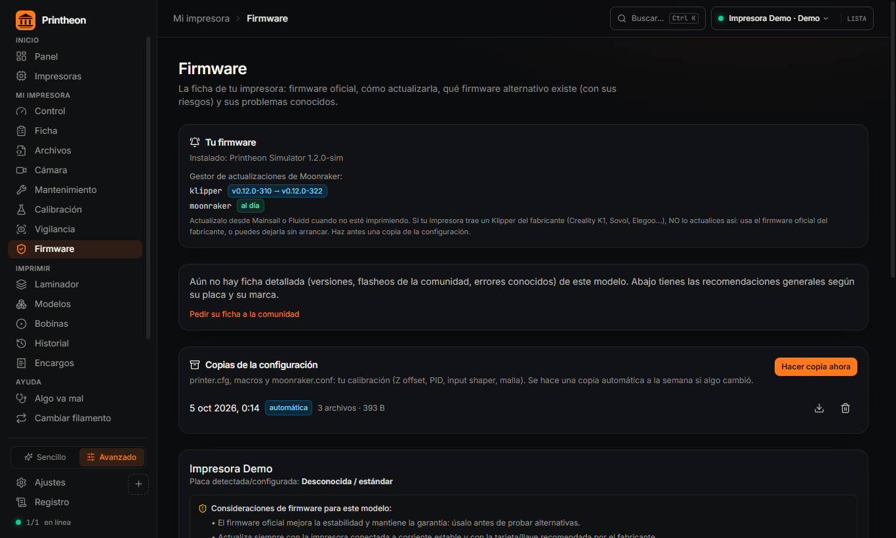

  

<h1 align="center">Printheon</h1>

<h3 align="center">The only app your 3D printer needs.</h3>

  Control · Slicing · Calibration · Diagnostics · Repairs · Failure detection · Filament · Firmware · Print farm

  
  
  
  
  
  

> [!TIP]
> 🎉 **Printheon Free 1.0.0 is out!** One free Windows app to control, slice, calibrate and diagnose your FDM printers, in English and Spanish.
> **[⬇️ Download Printheon Free 1.0.0](../../releases/latest)** · installer or portable · [What's new](CHANGELOG.md)

  <a href="README.es.md"><b>🇪🇸 Leer en español</b></a> ·
  <a href="#what-it-replaces">What it replaces</a> ·
  <a href="#features">Features</a> ·
  <a href="#every-printer">Every printer</a> ·
  <a href="#free-and-premium">Free and Premium</a> ·
  <a href="#status">Status</a>

  

## Stop juggling apps

A slicer. The printer's web panel. A phone app for the camera. A spaghetti detector in the cloud. A spreadsheet for spools. A cost calculator. And forums, videos and luck every time the printer throws an error.

**Printheon replaces all of it with one desktop app.** Connect your printer once and do everything from the same window: find a model, slice it, send it, watch it, and fix the printer when something breaks. It reads your machine on its own, knows its official limits, and won't let anything go past them.

Two modes, one app. **Simple** for people who just want to print. **Advanced** for people who want every parameter, every calibration and a whole print farm.

Comes in two editions: **Printheon Free**, free for everyone, and **Printheon Premium** for people who want to push their printers further. Features marked 👑 are Premium.

## What it replaces

| What you use today | In Printheon |
|---|---|
| Cura / PrusaSlicer / OrcaSlicer | **Built-in slicer** on the OrcaSlicer engine, with profiles for your exact printer |
| Mainsail, Fluidd, OctoPrint, Bambu Studio, PrusaLink | **One control panel** for every printer you own, whatever its firmware |
| Cloud failure-detection services | **Spaghetti detection with AI that runs on your PC.** No cloud 👑 *Premium* |
| Spool spreadsheets | **Filament inventory** that subtracts every print on its own |
| Forums and YouTube when it breaks | **Automatic printer tests, error code lookup, 25 guided fixes and 46 repair guides** |
| Calibration prints and copying numbers by hand | **Calibrations that run, apply and save the result** 👑 *Premium* |
| Online cost calculators | **Real cost per part and quotes** with margin, VAT and order tracking 👑 *Premium* |
| Printables / Thingiverse in a browser tab | **Model search inside the app**, one click to slice |

## Features

### 🎛️ Full control, for every printer
Temperatures, axes, fans, lights, emergency stop, and speed and flow changes live mid-print. Live camera and snapshots, plus automatic timelapses 👑 *Premium*. Files, a print queue per printer 👑 *Premium*, and **farm mode** 👑 *Premium*: one dashboard for all your printers and a queue that sends each job to the next free machine.

### 📋 It reads your printer for you
Connect, and Printheon reads everything the printer knows about itself: build volume, nozzle, maximum temperatures, firmware versions, probe offsets, bed mesh, Z offset… It compares all of it with the manufacturer's official sheet and tells you if anything doesn't match. You don't type in a single setting.

### 🩺 When something goes wrong, it finds out why
This is what makes Printheon different. When a printer throws an error, people end up unplugging cables and turning fans on one by one to rule things out. **Printheon does that for you:**

- **13 automatic printer tests:** connection, thermistors, every fan one by one, nozzle heater, bed heater, endstops, probe, homing, motion, extruder, filament sensor, lights and camera. Each test switches things on, measures, asks you what you saw, and turns everything off when it's done. Results are saved so you can compare over time.
- **Error code lookup:** Bambu Lab HMS codes, Prusa error numbers, Klipper and Marlin messages. It explains the error and runs the tests related to it.
- **25 guided fixes** for real problems: first layer won't stick, warping, stringing, under-extrusion, layer shifts, spaghetti, thermal runaway, disconnections and more.

### 🔧 Unclogs it, step by step or by itself
Tell it the symptom and it picks the method that works: hot purge, pulse extrusion, cold pull, heat creep or extruder gears. Automatic when the printer can do it alone, guided when you need to use your hands. Temperatures always match the loaded material. Filament changes are guided too, so you swap colours without jams.

### 🎯 Calibration that finishes the job
- **PID autotune** for nozzle and bed: run, apply and save, no copying numbers. 👑 *Premium*
- **Input shaper** with the printer's accelerometer: measures each axis and picks the best filter. 👑 *Premium*
- **Z offset with a sheet of paper**, and **babystepping you can save for good** 👑 *Premium*.
- **Bed mesh**: see it, and measure and save it from the app 👑 *Premium*.
- Guides for E-steps, pressure advance and belt tension.

### 👁️ Watches every print
- **AI spaghetti detection on the camera**, running locally on your computer. It can pause the print before it wastes a whole spool. 👑 *Premium*
- **Telemetry watch**: temperature lost mid-print, heaters that never get there, a loose thermistor, a print that stopped advancing, a dropped connection, a covered camera.
- **Alerts on your phone** through Telegram, Discord or ntfy. 👑 *Premium*

### 🛡️ Firmware and backups
- A firmware sheet for each model: the official version, how to update it, community firmwares with their real risks, and known problems.
- Update alerts for Klipper, Bambu Lab and OctoPrint. 👑 *Premium*
- **Automatic configuration backups** (printer.cfg and macros, RRF config, Marlin EEPROM), ready to restore if an update goes wrong. 👑 *Premium*

### 🖨️ And everything around the print
- **Slicer** on the OrcaSlicer engine with official profiles and the cost of every part. Every engine parameter, A/B profile comparison and batches 👑 *Premium*.
- **3D models**: browse Printables and Thingiverse by category inside the app, save them to your library and slice in one click. Links to MakerWorld, Thangs, Cults3D, MyMiniFactory and more.
- **Spools**: inventory by material, colour and weight. Each print is subtracted automatically, and you get a warning before a spool runs out.
- **History and statistics** of every print.
- **Maintenance** reminders by printing hours: lubrication, belts, nozzle.
- **Quotes and orders** with real cost, margin and VAT, for anyone selling prints. 👑 *Premium*
- **First print wizard**: from the box to the first good part, checking everything on the way.
- Search everything with **Ctrl + K**, export your profiles, and back up the whole app.

## Built so you don't break your printer

Every temperature, speed, flow value and command Printheon sends is checked against the **official limits of your printer**. If it goes over, it's blocked. It doesn't matter whether it comes from a button, a macro, the terminal or a G-code file. Calibrations and tests always clean up after themselves: whatever they switch on, they switch off.

## Every printer

If your printer runs **Klipper, Marlin, RepRapFirmware, PrusaLink, OctoPrint, ESP3D, Bambu Lab or Elegoo's network firmware**, Printheon can drive it. That covers practically every FDM printer on the market.

| Connection | What it covers |
|---|---|
| **Klipper** (Moonraker, Mainsail, Fluidd, RatOS) | Voron, RatRig, Sovol SV08, Elegoo Neptune 4, Qidi, Creality with Klipper, and any Klipper build |
| **Bambu Lab** on your local network | A1 mini, A1, P1P, P1S, X1 Carbon, X1E, H2D and the rest of the range |
| **PrusaLink** | MK4 / MK4S, MK3.5, MINI+, XL, CORE One |
| **USB cable** (Marlin) | Ender, CR-10, Anycubic, Artillery, Prusa MK3S+, Sovol, Geeetech and any Marlin printer |
| **OctoPrint** | Any printer behind OctoPrint |
| **Duet / RepRapFirmware** | Duet 2, Duet Maestro, Duet 3 |
| **ESP3D** | WiFi boards from BigTreeTech, MKS and others |
| **Elegoo** on your local network | Centauri Carbon 2 |

On top of that, the built-in catalogue carries the **official sheet of 254 models and 102 variants from 58 brands**, every one of them with its source: volume, temperatures, speeds, firmware and slicer profile.

<b>See all 254 models by brand</b>

| Brand | Models |
|---|---|
| **Creality** | K1 · K1 SE · K1C · K1 Max · K2 SE · K2 · K2 Pro · K2 Plus · K3 (KliTek) · Hi · Ender 3 · Ender 3 V2 · Ender 3 S1 · Ender 3 S1 Plus · Ender 3 V3 SE · Ender 3 V3 KE · Ender 3 V3 · Ender 3 V3 Plus · Ender 5 · Ender 5 Plus · Ender 5 S1 · Ender 5 Max · Ender 6 · CR-6 SE · CR-6 Max · CR-10 V2 · CR-10 V3 · CR-10 Max · CR-10 SE · CR-M4 · Sermoon V1 · SPARKX i7 · Ender-3 V4 |
| **Anycubic** | Kobra 2 series · Kobra S1 · Kobra 3 · Kobra 3 Max · Kobra S1 Max · Vyper · Mega X · Kobra · Kobra Plus · Kobra Max · Kobra Neo · Kobra X · i3 Mega S · Chiron · 4Max Pro / 4Max Pro 2.0 · Predator (delta) |
| **Bambu Lab** | A1 mini · A1 · A2L · P1P · P1S · P2S · X1 Carbon · X1E · X2D · H2S · H2D · H2C · H2D Pro |
| **Geeetech** | A10M / A10T · A20 / A20M · A30 Pro / A30M / A30T · A10 Pro · Mizar M · Mizar S · Mizar Pro · Mizar · Mizar Max · Thunder · M1 (mini) |
| **Artillery** | Sidewinder X2 · Sidewinder X4 Pro · Genius Pro · Sidewinder X3 Plus · Sidewinder X3 Pro · Sidewinder X4 Plus · Sidewinder X1 · Genius · Hornet · M1 Pro |
| **Elegoo** | Neptune 3 / 3 Pro · Neptune 4 series · Centauri Carbon · Centauri Carbon 2 · OrangeStorm Giga · Neptune 2 / 2S · Neptune 2D · Neptune X · Centauri · Centauri 2 |
| **QIDI Tech** | X-Plus 3 · X-Max 3 · Plus4 · Max4 (X-Max 4) · Q1 Pro · Q2 / Q2C · X-Smart 3 · X-Max · X-Plus · X-CF Pro |
| **FlashForge** | Adventurer 5M · AD5X · Creator 4 · Creator 5 / 5 Pro · Guider 3 Ultra · Guider 4 / 4 Pro · Guider 2s · Adventurer 3 · Adventurer 4 |
| **Sovol** | SV06 / SV06 Plus · SV07 / SV07 Plus · SV08 (CoreXY) · SV08 Max · Zero · SV06 ACE / SV06 Plus ACE · SV01 / SV01 Pro · SV02 · SV05 |
| **Volumic** | EXO42 · EXO65 · SH65 · VS30SC2 · VS30MK3 · VS30SC · VS30MK2 · VS30 Ultra · VS20MK2 |
| **Prusa Research** | i3 MK3S+ · MK4 / MK4S · MK3.5 / MK3.5S · Core One · Core One L · XL · MINI+ |
| **FLSun** | S1 · T1 · V400 · QQ-S Pro · Q5 |
| **MagicMaker** | BoneKing · hj SK · hqs SF · hqs hj · slb |
| **Snapmaker** | J1 / J1s · U1 · Artisan (3-in-1) · A350 / A350T · A250 / A250T |
| **Voron** | V2.4 R2 · V0.2 · Trident · Switchwire · V0.1 |
| **Z-Bolt** | S300 · S400 · S600 · S1000 · S800 Dual |
| **CoLiDo** | SR1 · DIY 4.0 · X16 · 160 V2 |
| **FlyingBear** | Ghost 7 · Ghost 6 · Reborn 3 · S1 |
| **RatRig** | V-Core 4 · V-Core 3 · V-Minion · V-Cast |
| **re:3D** | Gigabot 4 · Terabot 4 · GigabotX 2 (pellets) · TerabotX 2 (pellets) |
| **SeeMeCNC** | RostockMAX v4 · RostockMAX v3.2 · BOSSdelta 300 · BOSSdelta 500 |
| **Tiertime** | UP300 HS · UP600 HS · UP400 Pro · UP310 Pro |
| **Ultimaker** | S5 / S5 Pro Bundle · S3 / S3 Pro · Method X · Ultimaker 2 |
| **Wanhao** | Duplicator 12/300 · Duplicator 12/230 M2 PRO · Duplicator 12/300 M2 PRO MAX · Duplicator 12/500 PRO MAX M2 |
| **BIQU** | Hurakan · BX · B1 |
| **BLOCKS** | Pro S100 · RD50 V2 · RF50 |
| **Cubicon** | xCeler Plus · xCeler-I · xCeler Mini |
| **DeltaMaker** | DeltaMaker 2 · DeltaMaker 2T · DeltaMaker 2XT |
| **Dremel** | DigiLab 3D45 · DigiLab 3D40 · Idea Builder 3D20 |
| **Folger Tech** | FT-5 · FT-6 · i3 (kit) |
| **Kingroon** | KP3S / KP3S Pro · KP5L · KLP1 |
| **LulzBot** | TAZ Pro / TAZ Pro Dual · TAZ 6 · TAZ 4 / TAZ 5 |
| **Two Trees** | SK1 · Sapphire Plus · SP-5 |
| **Comgrow** | T300 · T500 |
| **Construct3D** | Construct 1 · Construct 1 XL |
| **Eryone** | Thinker X400 · ER-20 |
| **InfiMech** | EX · TX |
| **RolohaunDesign** | Rook MK1 (LDO) · Delta Flyer Refit |
| **SecKit** | SK-Tank · Go3 |
| **WEMAKE3D** | Phoenix Pro · TinyBot |
| **WonderMaker** | ZR Ultra · ZR |
| **Afinia** | H+1 (HS) |
| **AnkerMake** | M5 / M5C |
| **Chuanying** | X1 |
| **Co Print** | ChromaSet |
| **LH** | Stinger |
| **LONGER** | LK10 / LK10 Plus |
| **Mellow** | M1 |
| **OpenEYE** | Peacock V2 |
| **Peopoly** | Magneto X |
| **Phrozen** | Arco |
| **Positron3D** | The Positron |
| **Raise3D** | Pro3 series |
| **RH3D** | E3NG v1.2S |
| **Tronxy** | X5SA-400 |
| **Vivedino** | Troodon 2.0 |
| **Voxelab** | Aquila X2 |
| **VzBoT** | VzBoT AWD |

## Free and Premium

**Printheon Free** is the full everyday app, free, with no time limit and no ads. Everything that protects your printer or gets you out of trouble is free, and always will be.

**Printheon Premium** unlocks the tools that squeeze more out of your printer or help you make money with it. Locked features stay visible in the app, so you always know what's there.

| Printheon Free | Printheon Premium 👑 |
|---|---|
| Control of up to 3 printers, camera and files | Everything in Free, with as many printers as you own |
| Printer info read automatically | Print queue per printer, and farm mode: one board for all printers and a queue that feeds the next free one |
| 13 automatic printer tests, error codes and guided fixes | AI spaghetti detection with automatic pause |
| Unclogging and filament changes | Automatic calibration: PID, input shaper, bed mesh, saved babystep |
| Official safety limits on every command | Automatic configuration backups |
| Slicer with official profiles | Advanced slicer: every parameter, A/B comparison, batches |
| Model search, spools, history, maintenance | Phone alerts (Telegram, Discord, ntfy) and timelapses |
| Manual calibration guides and Z offset with paper | Firmware update alerts, quotes and orders |

Premium is included in the **Founder** tier on [Patreon](https://www.patreon.com/DREL3).

## Status

**Printheon Free 1.0.0 is out.** [Download it from Releases](../../releases/latest): the installer (recommended) or the portable version, which runs without installing. Windows may warn about an unknown publisher the first time: click *More info → Run anyway*.

| | |
|---|---|
| **Platform** | Windows desktop app: installer or portable (no install needed), runs from the system tray |
| **Language** | English and Spanish, chosen when installing (and changeable in Settings) |
| **Editions** | Printheon Free, and Printheon Premium (👑 features) included in the Founder tier on Patreon |
| **Support** | [Patreon](https://www.patreon.com/DREL3): Supporter, Beta Tester and Founder tiers |

## Have your say

Open an [issue](../../issues) to:
- ask for a feature,
- ask for your printer if it isn't on the list,
- tell me which apps you use today, so Printheon can replace them too.

⭐ **Star the repo** to follow progress and get notified at launch.

---

Screenshots taken from the current development build using the built-in printer simulator. © Printheon. All rights reserved.
